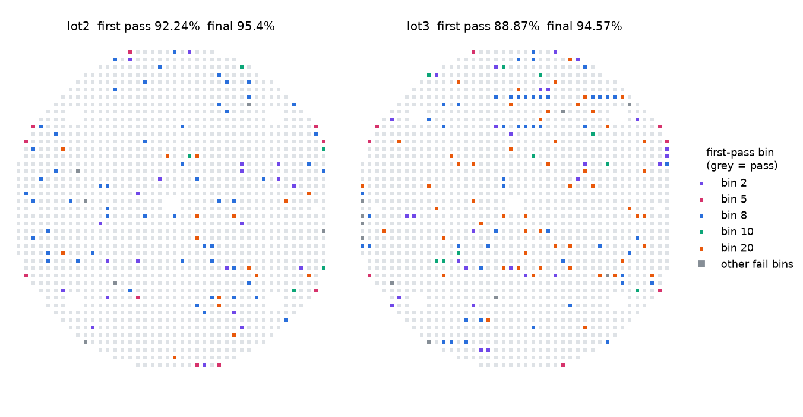

# ATE Test Data Pipeline

From raw ATE tester output (STDF v4) to yield analytics: a hands-on learning
project that applies data engineering (Python, SQL, PySpark, Databricks) to
semiconductor test data.

## Data

Three public demo STDF files from wafer sort (Galaxy Semiconductor demo data,
shipped with [pystdf](https://github.com/cmars/pystdf)): lot `GAL-LOT`, part
`GOLD8BAR`, tester `A530`. Each wafer has 1,456 dies with X/Y coordinates,
plus end-of-wafer retests (about 1,600 test insertions per file), ~52,000
parametric measurements with limits and units, and the tester's own hard/soft
bin summaries. `demofile.stdf` turns out to be `lot3.stdf` relabelled, so
there are two distinct wafers.

## Results

[`docs/FINDINGS.md`](docs/FINDINGS.md) has what the data says, with figures.
In short: the tester's yield counts retests twice; one failing bin is a
measurement-resolution problem that disappears on retest; another is an
off-centre trim target; and the wafer edge fails about twice as often (logistic
regression).



## Setup

```bash
python -m venv .venv
.venv\Scripts\activate          # Windows  (macOS/Linux: source .venv/bin/activate)
pip install -e ".[dev]"            # includes the analysis extras (matplotlib, scipy, statsmodels)
python scripts/get_sample_data.py
pytest
```

## Phase 1 - Ingest (done: the reference to build on)

```bash
python -m ate_pipeline.ingest data/raw/lot2.stdf --out data/parquet/lot2
python -m ate_pipeline.report data/parquet/lot2
```

`ingest.py` turns one STDF file into four Parquet tables:

| Table | Grain | Key columns |
|-------|-------|-------------|
| `lot` | one per file | lot_id, part_type, tester_type, program, start_time |
| `parts` | one per die | part_index, wafer_id, site, hard_bin, soft_bin, passed, x, y |
| `test_results` | one per PTR measurement | part_index, test_num, test_name, result, lo, hi, units, passed |
| `bins` | tester's HBR/SBR records | kind, head, site, bin, count |

The tests check the parser against the tester's own bookkeeping: computed good
insertions must equal the tester's bin-1 count (lot2: 1,389 of 1,569). That is
insertion yield, 88.53%. Per die, lot2 is 92.24% first pass and 95.40% final
(`report.die_yield`).

STDF details worth knowing before you extend it:
- A PTR carries limits and units only on the first occurrence of each test;
  later PTRs set `OPT_FLAG` bits 4/5 and inherit them (`_on_ptr`).
- Measurements arrive between a PIR and a PRR per (head, site); the PRR closes
  the part and carries its bin, pass flag and X/Y (`_on_prr`).
- `HEAD_NUM == 255` on HBR/SBR means "summary across all sites".

## Analysis (done)

```bash
python -m ate_pipeline.analysis data/raw/lot2.stdf data/raw/lot3.stdf data/raw/demofile.stdf --figures docs/figures
```

`analysis.py` adds content fingerprinting (skips duplicate files), datalog
coverage, per-die yield with retest recovery, bin signatures, classic vs robust
Cpk with a measurement-resolution check, wafer maps, a radial logistic
regression and a failure-burst test.

## Phase 2 - Pipeline in PySpark / Databricks (your turn)

Goal: process all three lots as one dataset.
- [ ] Ingest all files in `data/raw/` with a `lot_id`/`source_file` column on every table
- [ ] Load the Parquet into Spark (`spark.read.parquet`) - locally with `pip install pyspark`, or in Databricks Free Edition
- [ ] Write them as Delta tables in a bronze/silver layout: bronze = as parsed, silver = typed, deduplicated, with `lot_id` + `wafer_id` + `x` + `y` as the die key (`part_id` repeats across retests of the same die)
- [ ] Add a gold `die_result` table with first-pass and final bin per die, and check it against `report.die_yield`
- [ ] Make the job idempotent: re-running on the same file must not duplicate rows

## Phase 3 - Analytics in SQL (your turn)

Rebuild `report.py` in SQL over the silver tables, then go further. Use
`report.py`'s output as the answer key.
- [ ] Yield per lot and per wafer, first pass and final (answer key: `analysis.py`)
- [ ] Hard-bin Pareto with cumulative %
- [ ] Cpk per test (window functions), worst 10 per lot
- [ ] Drift: per-test mean and sigma per lot - which tests move between lots?
- [ ] Site-to-site comparison (multi-site testers mask problems in one site)

## Phase 4 - Dashboard (your turn)

- [x] Wafer map: X/Y coloured by hard bin (`analysis.plot_wafer_maps`)
- [ ] Interactive version (plotly) with a lot selector and hover showing the die's tests
- [ ] Yield trend and bin Pareto per lot
- [ ] Databricks SQL dashboard or a small Streamlit app

## Phase 5 - Yield prediction (stretch)

- [ ] [UCI SECOM](https://archive.ics.uci.edu/dataset/179/secom): 1,567 runs, 591 sensor features, 104 failures
- [ ] Handle missing values and the 14:1 class imbalance; report precision/recall, not accuracy

## Learning resources

- [Data Engineering Zoomcamp](https://github.com/DataTalksClub/data-engineering-zoomcamp) (free, self-paced): Docker, dbt, Spark, Kafka - make this project your final project
- STDF V4 specification (search "STDF V4 specification Teradyne") for every record field used here

## License

GPL-2.0-or-later (see `LICENSE`), matching pystdf, which this project imports.
