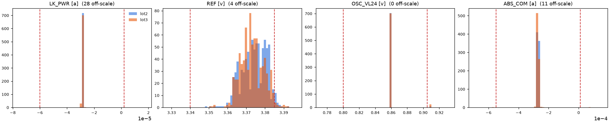
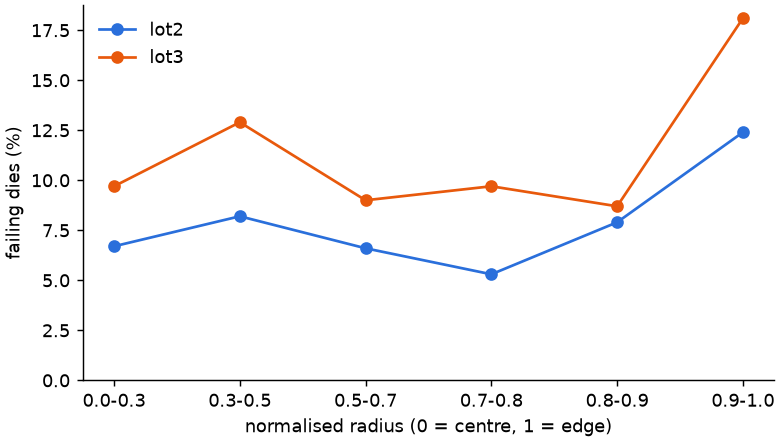

# Findings: lot2 vs lot3 (Galaxy demo wafers)

Reproduce every number here with:

```bash
pip install -e ".[analysis]"
python -m ate_pipeline.analysis data/raw/lot2.stdf data/raw/lot3.stdf data/raw/demofile.stdf --figures docs/figures
```

`tests/test_analysis.py` pins the key numbers, so a parser change that moves them fails the suite.

## TL;DR

| # | Finding | Evidence | What a test/product engineer would do |
|---|---------|----------|---------------------------------------|
| 1 | The tester's yield (88.5% / 85.1%) counts retests twice. Per die, lot2 is 92.2% first pass and 95.4% final; lot3 is 88.9% and 94.6% | 1,569 / 1,619 PRRs but only 1,456 distinct X/Y per wafer | Report first-pass and final yield per die, never per insertion |
| 2 | Bin 20 (OSC_VL24) is a test problem, not a silicon problem | 97% of bin-20 dies pass on retest; the test only ever reads 0.86 V or 0.91 V (0.05 V steps) against a 0.800 to 0.905 V window | Fix the measurement resolution or range before chasing the oscillator. It accounts for 2.6 of lot3's 3.4-point first-pass drop |
| 3 | Bin 8 (REF trim) is a centring problem | REF median 3.373 V in a 3.340 to 3.385 V window: Cp 1.03 but Cpk 0.53. Shifting the same data to mid-window cuts REF fails from 2.35% to 0.46% | Move the trim (zap) target down about 10 mV |
| 4 | Bins 2, 5 and 10 are real defects | 0% recovery on retest. Bin 2 = leakage (LK_PWR / LKG_BOOT), bin 10 = ABS_COM | Failure analysis, not test tuning |
| 5 | The outer 10% of the wafer fails about twice as often | Logistic regression on first-pass die result: edge odds ratio 1.95 (95% CI 1.44 to 2.64). An edge-ring term beats a smooth r + r² (AIC 1800 vs 1806) | Check edge-die process steps (bevel, lithography focus at the edge) |
| 6 | lot3 had a burst of failures during probing | 6 consecutive first-pass fails in test order (p = 0.004 against shuffled order). Next to a failing die, the fail rate is 1.36× what position alone predicts; lot2 shows neither | Look at the prober or contact logs for that stretch (row y = -9, x = 24 to 38) |
| 7 | The "negative Cpk" on LK_PWR is a statistics artifact | A few gross failures at about -10 mA inflate sigma and drag the mean. The robust Cpk (median, MAD) of the main population is far above 1.33 | Use robust Cpk for test data, and count the gross-failure tail separately as defect rate |
| 8 | Only every second part carries parametric data | 784 of 1,569 parts have PTRs: every odd part_index, flagged by a GDR `IMAGE_PART_ID` record. `NUM_TEST` in the PRR still counts about 72 tests on the others | Per-test statistics describe a 50% sample. Say so next to every Cpk |
| 9 | `demofile.stdf` is `lot3.stdf` under another name | Identical bins, X/Y and measurements; only the lot, part and program labels differ | The pipeline fingerprints content and skips duplicates |

## Figures


The lot3 wafer shows the horizontal run of bin 8 near the top (finding 6), and bin 20 (orange) spread across the wafer. A spread with no spatial pattern is what a measurement problem looks like.



LK_PWR and ABS_COM are needle-thin populations far inside their limits; their fails are off-scale outliers. REF sits against its upper limit. OSC_VL24 has two possible readings.



## Method notes and limits

- **Retests.** A die is identified by (lot, X, Y). First pass is its first PRR; final is its last. The tester's own HBR/SBR summaries count insertions. That is why `test_ingest.py` matches them against insertion counts.
- **Robust Cpk.** Cpk = min(HI − median, median − LO) / (3 · 1.4826 · MAD), with an IQR fallback when MAD is 0. This is a common robust variant. ISO 22514-2 describes percentile-based capability for non-normal data. With about 700 points per lot, the 0.135% tails are too thin to estimate, so the MAD form is used here.
- **Resolution.** The flag uses the AIAG MSA rule of thumb: the gauge should resolve at least one tenth of the tolerance. Resolution is the smallest step between distinct readings in the data.
- **Regression.** One row per die (first pass), so retests do not double-count. Each lot is a single wafer, so a lot effect is also a wafer effect (odds ratio 1.49 for lot3). Two wafers cannot separate lot-to-lot from wafer-to-wafer variation. The model treats dies as independent; finding 6 shows that is not quite true for lot3.
- **Not established.** Why the first failure burst happened in lot3. The data has no prober or contact records. Whether the 0.91 V readings on OSC_VL24 are noise or a real shift also cannot be told apart at this resolution, and that is the point of finding 2.
